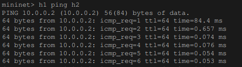
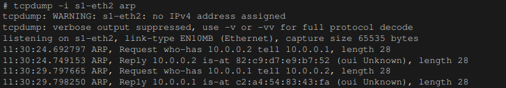
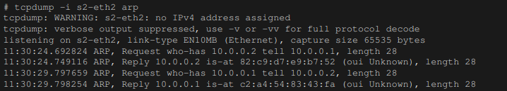
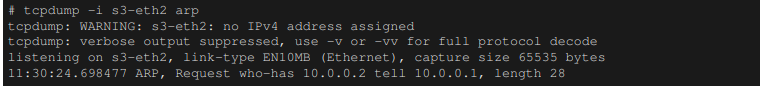

# Using SDN to implement spanning tree
## Problem Statement
To design a software designed network to control traffic coming into the devices .
This project aims at proving a concept that software defined network could be used to implement network security for IoT devices by implementing spanning tree for a given network topology.
## Tools
### Mininet
For creating the network topology, we are using mininet.Mininet emulates a complete network of hosts, links, and switches on a single machine. More about mininet could be found in [mininet](http://mininet.org/).  

### Ryu
For controlling the data traffic for the switches, we use ryu as a controller.Ryu provides well defined APIs that makes it easy for the developers to create network management.More about Ryu could be found
on [ryu](https://ryu-sdn.org/) 

## Network topology
topo.py is used to create the network topology. The network consists to 3 nodes h1,h2,h3 and 3 switches s1,s2,s3 with each hosts connnected their corresponding switch namely h1->s1 ,h2->s2 and h3->s3. Each switches are connected to each other ,so there are links for s1->s2,s3 ,s2->s1,s3,s3->s1,s2.  
ryu.py consists of python APIs for configuring the switch to work as spanning tree.On startup, the ryu begins the BPDU packet exchange to select the root node.After the port role is decided (STP calculation is completed), each port becomes LISTEN state. After
that, the state changes according to the role of each port, it eventually becomes
FORWARD state or BLOCK state which is handled by _port_state_change_handler(). 

## Results
Before executing the ping requests, we can start the tcpdump to monitor the traffics of all the switches.
```
#tcpdump -i s1-eth2 arp
```
Execute this for all other switches as well.  
On the console where the topology configuration script is executed, execute the following commands to issue a
ping from host 1 to host 2.

 After implementing the spanning tree we can confirm that the ARP are not being looped in the network.  
 Node s1:
 
 Node s2:
 
Node s3:


## Conclusion
The results obtained could be easily extended to create a software defined network for IoT devices .We can add rules in the controller to allow/deny traffic based on certain criteria like mac address, Ip etc and the switches would behave as per the rules set by the controller.